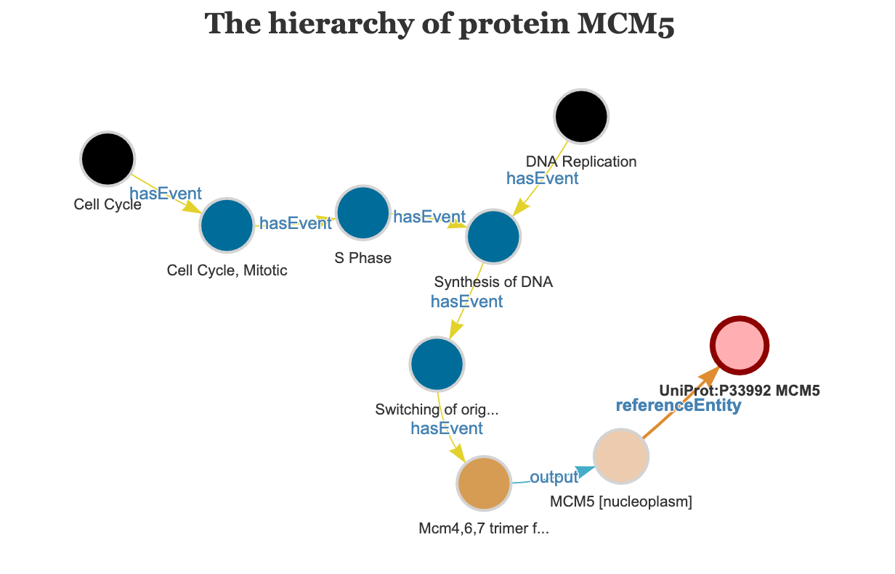

# ReactomeGraph4R: an R interface for Reactome Graph Database

<!-- badges: start -->
[](https://www.repostatus.org/#active)
<!-- badges: end -->


## Local Reactome Graph Database setup

1. Get Docker: https://docs.docker.com/get-docker/
2. Download and install Reactome Graph Database:
```
mkdir -p $(pwd)/neo4j/data/databases
# download the file
wget https://reactome.org/download/current/reactome.graphdb.tgz -P $(pwd)/neo4j/data/databases
# extract
tar -zxvf $(pwd)/neo4j/data/databases/reactome.graphdb.tgz -C $(pwd)/neo4j/data/databases
# run on docker
docker run --name reactome_graph_db -p 7687:7687 -p 7474:7474 -e NEO4J_dbms_allow__upgrade=true -e NEO4J_AUTH=none -v $(pwd)/neo4j/data:/data neo4j:3.5.19
```

3. Lauch Neo4j through browser:
```
http://localhost:7474
```

If you want to set a password, you can remove `NEO4J_AUTH=none` in the command. The default username and password are both `neo4j`, after login you will be prompted the change the new password.

The next time you run the Graph Database, you can just start running docker and type:
```
docker start reactome_graph_db
```

You could also try to explore the Graph Database and query Reactome data using Cypher, more details see this [tutorial](https://reactome.org/dev/graph-database/extract-participating-molecules).

## Installation

Install from GitHub:
```
devtools::install_github("reactome/ReactomeGraph4R")
```
or from CRAN:
```
install.packages("reactome/ReactomeGraph4R")
```

👉 Note that package [`neo4r`](https://github.com/neo4j-rstats/neo4r) __(>= 0.1.3)__ is required, install the lastest one from GitHub:
```
devtools::install_github("neo4j-rstats/neo4r")
```


## Examples

Read complementary vignette at ___

### Loading and connection

Load the package
```
library(ReactomeGraph4R)
```
Then connect to local Neo4j server by answering two questions:

- Is the url 'http://localhost:7474'? (Yes/no/cancel)
- Does Neo4J require authentication? (Yes/no/cancel)


Results are in these two formats:

- "row": a list of results in dataframes (default)
- "graph": a graph object with nodes and relationships information

### Row data

Using Reactome id:
``` r
matchPrecedingAndFollowingEvents(event.id = "R-HSA-8983688", type = "row")
#> Retrieving immediately connected instances... Specify depth-related arguments for more depths
#> $precedingEvent
#>   schemaClass  speciesName isInDisease releaseDate            displayName     stIdVersion    dbId                   name isChimeric          stId
#> 1    Reaction Homo sapiens       FALSE  2018-09-12 OAS1 binds viral dsRNA R-HSA-8983671.1 8983671 OAS1 binds viral dsRNA      FALSE R-HSA-8983671
#>   category isInferred
#> 1  binding      FALSE
#> 
#> $event
#>   schemaClass  speciesName isInDisease releaseDate       displayName     stIdVersion    dbId              name isChimeric          stId category
#> 1    Reaction Homo sapiens       FALSE  2018-09-12 OAS1 oligomerizes R-HSA-8983688.1 8983688 OAS1 oligomerizes      FALSE R-HSA-8983688  binding
#>   isInferred
#> 1      FALSE
#> 
#> $followingEvent
#>      schemaClass  speciesName isInDisease releaseDate                   displayName     stIdVersion    dbId                          name isChimeric
#> 1 Polymerisation Homo sapiens       FALSE  2018-09-12 OAS1 produces oligoadenylates R-HSA-8983680.1 8983680 OAS1 produces oligoadenylates      FALSE
#>            stId   category isInferred
#> 1 R-HSA-8983680 transition      FALSE
#> 
#> $relationships
#>   neo4jId           type startNode.neo4jId startNode.dbId startNode.schemaClass endNode.neo4jId endNode.dbId endNode.schemaClass properties
#> 1 7685968 precedingEvent           1808570        8983680        Polymerisation         1808457      8983688            Reaction       1, 0
#> 2 7685746 precedingEvent           1808457        8983688              Reaction         1808512      8983671            Reaction       1, 0
```


Using non-Reactome id:
``` r
row <- matchHierarchy(id = "P33992", databaseName = "UniProt", type = "row")
str(row, max.level = 1)
#> List of 5
#>  $ referenceEntity:'data.frame':	1 obs. of  17 variables:
#>  $ physicalEntity :'data.frame':	1 obs. of  12 variables:
#>  $ event          :'data.frame':	1 obs. of  12 variables:
#>  $ upperevent     :'data.frame':	6 obs. of  18 variables:
#>  $ relationships  :'data.frame':	8 obs. of  9 variables:
```

`row` looks like the returned result of the last command.

### Graph data

Every graph result contains two dataframes - "nodes" and "relationships".
``` r
graph <- matchHierarchy(id = "P33992", databaseName = "UniProt", type = "graph")
str(graph, max.level = 2)
#> List of 2
#>  $ nodes        :'data.frame':	9 obs. of  3 variables:
#>   ..$ id        : chr [1:9] "422883" "90375" "422833" "90376" ...
#>   ..$ label     :List of 9
#>   ..$ properties:List of 9
#>  $ relationships:'data.frame':	8 obs. of  5 variables:
#>   ..$ id        : chr [1:8] "1700863" "1701159" "360682" "1813950" ...
#>   ..$ type      : chr [1:8] "output" "hasEvent" "referenceEntity" "hasEvent" ...
#>   ..$ startNode : chr [1:8] "422833" "422883" "90375" "449402" ...
#>   ..$ endNode   : chr [1:8] "90375" "422833" "90376" "422883" ...
#>   ..$ properties:List of 8
```

`graph` could then be converted to objects in network visualization packages. The following is an example to get a `visNetwork` object from `graph`.

Extract nodes and edges from our result:
``` r
relationships <- graph[["relationships"]]
nodes <- graph[["nodes"]]
nodes <- unnestListCol(df = nodes, column = "properties")
```

Then select some columns:
``` r
library(stringr)
vis.nodes <- data.frame(id = nodes$id,
                        label = str_trunc(nodes$displayName, 20),
                        group = nodes$schemaClass,
                        title = paste0("<p><b>", nodes$schemaClass, "</b><br>",
                                "dbId: ", nodes$dbId, "<br>", nodes$displayName, "</p>"))

vis.edges <- data.frame(from = relationships$startNode,
                        to = relationships$endNode,
                        label = relationships$type)
```

Add parameters for nodes:
``` r
library(wesanderson) # for color palette

node.colors <- as.character(wes_palette(n = length(unique(vis.nodes$group)), name = "Darjeeling2"))
names(node.colors) <- unique(vis.nodes$group)
vis.nodes$color.background <- node.colors[as.numeric(factor(vis.nodes$group))]
vis.nodes$color.border <- "lightgray"
vis.nodes$color.border[vis.nodes$label == "UniProt:P33992 MCM5"] <- "pink"
vis.nodes$color.highlight.border <- "darkred"
vis.nodes$borderWidth <- 2 #> Node border width
```

Add parameters for edges:
``` r
vis.edges$width <- 1.2
edges.colors <- as.character(wes_palette(n = length(unique(vis.edges$label)), name = "FantasticFox1"))
names(edges.colors) <- unique(vis.edges$label)
vis.edges$color <- str_replace_all(vis.edges$label, edges.colors)
vis.edges$arrows <- "to"
vis.edges$smooth <- TRUE

library(visNetwork)
visNetwork(vis.nodes, vis.edges, main = "The hierarchy of protein MCM5", width = "100%")
```



Find the interactive one in the vignette!


## Feedback

We'd love to hear your feedback! Feel free to open an [issue](https://github.com/reactome/ReactomeGraph4R/issues) on GitHub.


